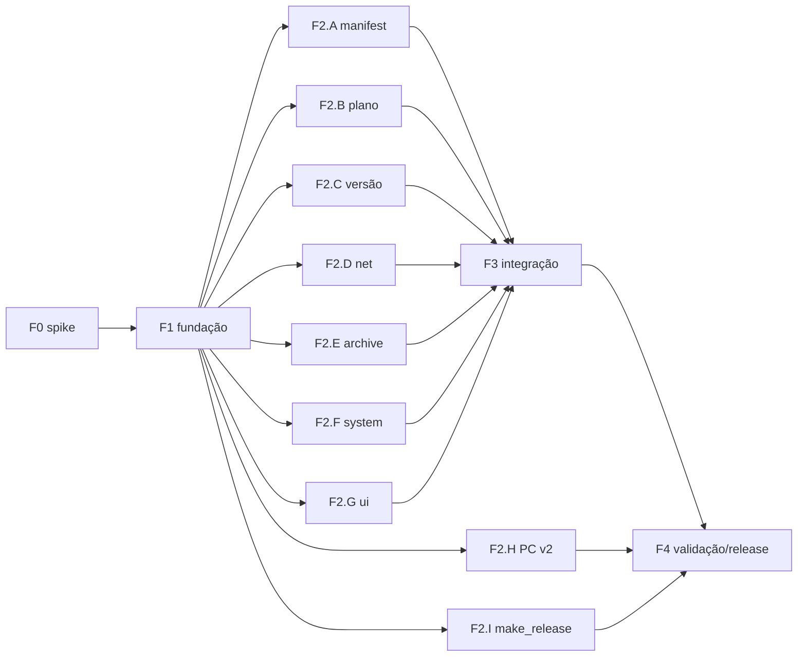

# UltraNX-NX — Plano de implementação

Atualizador do pacote **R O X** que roda **no próprio Nintendo Switch** (homebrew
`.nro`), no mesmo espírito do atualizador do CNX: baixa o pacote, apaga o que o
servidor manda apagar, extrai o novo e reinicia no hekate.

Status: **aguardando aprovação** — nenhum código de produção escrito.

## Objetivo

Permitir atualizar o cartão sem PC: abrir o app pelo Homebrew Menu, ver versão
instalada × publicada, escolher Padrão/Completo, confirmar, e ao fim reiniciar
direto no payload do hekate com o sistema já atualizado.

O servidor (manifest v2) passa a ser a fonte de **quais pacotes instalar** e
**o que apagar antes**, sem precisar lançar app novo quando a lista mudar.

## Escopo

- Homebrew `homebrew/` em C11 + libnx, interface de console de texto.
- Manifest v2 (contrato compartilhado com o app de PC) — ver `specs/data-model.md`.
- Fluxo: manifest → escolha → plano de limpeza → download **de tudo** para
  staging → verificação SHA-256 → limpeza → extração → `packetVersion.txt` →
  reboot para payload.
- Pacote dividido em partes (`archives[]`) — limite de 2 GB por asset do GitHub
  e de 4 GB por arquivo no FAT32.
- Whitelist embutida no cliente que o manifest **não** consegue sobrepor.
- Script `tools/make_release.py` que fatia o pacote e gera o manifest.
- App de PC passa a ler `cleanup` e `archives[]` do manifest v2 (com fallback v1).

## Fora de escopo (v1)

- Atualização de firmware do console, cheats, sigpatches avulsos.
- Interface gráfica (Borealis/SDL) — texto basta para um fluxo de 7 telas.
- Atualização incremental/diferencial.
- MediaFire no console (só link direto).
- Assinatura criptográfica do manifest (ed25519) — anotada como evolução em
  `specs/security.md`; a whitelist embutida limita o dano até lá.

## Premissas

- Console com Atmosphère e hekate; app aberto pelo Homebrew Menu.
- Pacotes publicados em repositório **público** do GitHub (download sem token).
- Pacote distribuído em `.zip` (deflate). `.7z` sólido continua só no PC.
- O próprio pacote traz `atmosphere/reboot_payload.bin` (hekate).

## Riscos

| Risco | Mitigação |
| --- | --- |
| Apagar `atmosphere/` com o sistema rodando dele | Tudo baixado e verificado **antes** de apagar; após extrair, reboot imediato para payload; HOME e auto-sleep bloqueados durante a aplicação |
| Falta de energia/queda no meio da aplicação | Exige bateria ≥ 30% ou carregador; marcador `staging/APPLYING` permite retomar a extração na próxima abertura (partes já verificadas continuam no staging) |
| Pacote > 4 GB em FAT32 | `archives[]` com partes ≤ 1,9 GB, cada uma um zip válido e independente |
| Manifest comprometido manda apagar dado do usuário | Whitelist embutida (Nintendo, emummc, `*.keys`, `*.sav`, JKSV, pasta do próprio app) vence sempre; caminhos validados contra `..`/absolutos |
| Arquivo aberto por sysmodule impede remoção | Falha de remoção vira aviso e a extração sobrescreve; aborta só se o item for crítico (`atmosphere/package3`) |
| Sobrescrever o `.nro` em execução | App não usa romfs (arquivo não fica aberto); pasta do app é protegida |
| TLS no console | curl com backend libnx (CA do sistema), `VERIFYPEER` ligado |
| Portlib `switch-*` ausente/diferente do esperado | Fase 0 é spike que valida toolchain antes de qualquer módulo |

## Stack

| Peça | Escolha | Por quê |
| --- | --- | --- |
| Toolchain | devkitPro devkitA64 + libnx | padrão de fato do homebrew Switch |
| HTTP | `switch-curl` (backend libnx TLS) | portlib pronta, streaming, progresso, retomada |
| JSON | `switch-jansson` | portlib pronta; validação explícita de tipos |
| ZIP | miniz 3.1.2 vendorizado (`third_party/miniz`, MIT) | arquivo único, compila igual no host e no console, sem depender de portlib; extração entrada a entrada |
| SHA-256 | `sha256Context*` da libnx | nativo, sem dependência extra |
| Reboot | `amsBpcSetRebootPayload` + `spsmShutdown(true)` | mecanismo oficial do Atmosphère |
| Testes do core | gcc no host + `greatest.h` (single header) + gcov | core em C puro roda no CI sem console |
| Release | `tools/make_release.py` (Python, stdlib) | mesma linguagem do app de PC |

## Estrutura de pastas (contrato de propriedade)

```
homebrew/
  Makefile                 # alvo .nro (devkitA64) e alvo `test` (gcc host)
  include/ultranx/         # contratos (F1) — só a fundação altera
  src/core/                # C puro, sem libnx: manifest, plan, paths, version
  src/platform/            # libnx/curl/miniz: net, archive, system, fs
  src/ui/                  # telas de console
  src/app/updater.c        # pipeline (F3)
  src/main.c
  tests/                   # testes do core no host
  docs/PLAN.md, docs/specs/*.md
tools/make_release.py      # gerador de partes + manifest
src/ultranx/...            # app de PC (já existe)
```

Regra estrutural: `src/core/` **não** inclui `<switch.h>` — mesma regra do PC
(`core/` sem PyQt6). É o que permite testar plano de limpeza e parser no CI.

## Fases e tarefas

### F0 — Spike de plataforma (sequencial)

| ID | Tarefa | Critério de aceite |
| --- | --- | --- |
| F0.1 | Toolchain + hello `.nro` | `make` gera `.nro` que abre no Homebrew Menu e imprime versão |
| F0.2 | Download HTTPS de asset do GitHub Releases | arquivo de 50 MB baixado com `VERIFYPEER=1`, redirect 302 seguido, SHA-256 confere |
| F0.3 | Extração zip no SD | zip de 1.000 arquivos extraído; tempo medido e anotado |
| F0.4 | Reboot para payload | `reboot_payload.bin` carregado e console reinicia no hekate |

Saída: anotações em `specs/architecture.md` (tempos, versões das portlibs).

### F1 — Fundação (sequencial)

| ID | Tarefa | Critério de aceite |
| --- | --- | --- |
| F1.1 | Scaffold `homebrew/`, Makefile com alvos `nro` e `test` | `make` e `make test` passam no CI |
| F1.2 | Headers de contrato em `include/ultranx/` (`manifest.h`, `plan.h`, `paths.h`, `version.h`, `net.h`, `archive.h`, `system.h`, `fs.h`, `ui.h`, `errors.h`); `plan.h` recebe listagem injetada (`UnxListDirFn`) para testar no host | compilam; assinaturas batem com `specs/architecture.md` |
| F1.3 | `docs/manifest.v2.schema.json` + exemplos v1/v2 | validados por `jsonschema` no CI |
| F1.4 | CI `.github/workflows/homebrew.yml`: job host (testes+cobertura) e job `devkitpro/devkita64` (build `.nro`); tag `homebrew-v*` publica release | ambos verdes |

### F2 — Módulos em paralelo (um subagente por linha, worktree isolado)

| ID | Módulo | Arquivos que pode tocar | Critério de aceite |
| --- | --- | --- | --- |
| F2.A | Parser de manifest v1/v2 | `src/core/manifest.c`, `tests/test_manifest.c` | aceita exemplos; rejeita os casos de `data-model.md` §Validação; cobertura ≥ 80% |
| F2.B | Paths + plano de limpeza + whitelist | `src/core/paths.c`, `src/core/plan.c`, `tests/test_plan.c` | todos os casos de `security.md` §Whitelist; manifest não remove item protegido |
| F2.C | `packetVersion.txt` + comparação | `src/core/version.c`, `tests/test_version.c` | mesmos casos do `test_version_inspector.py` do PC |
| F2.D | Download streaming | `src/platform/net.c` | retomada por `Range`, cancelamento, SHA em streaming, progresso; validado no console |
| F2.E | Extração zip | `src/platform/archive.c` | zip-slip descartado; progresso por entrada; validado no console |
| F2.F | Sistema | `src/platform/system.c` | bateria, espaço livre, bloqueio de HOME/sleep, reboot para payload |
| F2.G | Telas | `src/ui/*.c` | 7 telas de `ui.md` navegáveis com dados falsos |
| F2.H | App de PC lê manifest v2 | `src/ultranx/core/version_inspector.py`, `sanitizer.py`, `config.py`, testes | v1 continua funcionando; `cleanup` do servidor respeita whitelist local; pytest verde |
| F2.I | Gerador de release | `tools/make_release.py`, `tests/test_make_release.py` | fatia em ≤ 1,9 GB, cada parte zip válido; lê `--cleanup cleanup.json`; gera `manifest.json` (passa no schema) e `packetVersion.txt` |

F2.A–C dependem só de F1. F2.D–G dependem de F0+F1. F2.H e F2.I dependem só de F1.3.

### F3 — Integração (sequencial)

| ID | Tarefa | Critério de aceite |
| --- | --- | --- |
| F3.1 | `src/app/updater.c`: pipeline completo com retomada (`APPLYING`) | fluxo feliz no console real com SD de teste |
| F3.2 | Tratamento de falhas | cada falha de `architecture.md` §Falhas produz tela de erro com orientação; nada é apagado se o download falhar |

### F4 — Validação e release (sequencial)

| ID | Tarefa | Critério de aceite |
| --- | --- | --- |
| F4.1 | Checklist E2E em hardware (`testing.md` §E2E) | todos os itens marcados, inclusive desligar no meio |
| F4.2 | Revisões | code-reviewer + security-reviewer sem CRITICAL/HIGH abertos |
| F4.3 | Release | `.nro` publicado; pacote passa a trazer `switch/ultranx-nx/` |

## Grafo de dependências



Paralelo: tudo em F2 (9 frentes). Sequencial: F0 → F1 → F3 → F4.

## Estratégia de agentes

| Fase | Agente | Observação |
| --- | --- | --- |
| Plano/arquitetura/revisão de specs | Opus (sessão principal) + `architect` | este documento |
| F0, F1 | sessão principal | spike precisa de hardware: usuário roda o `.nro` e relata |
| F2.A–C, F2.H, F2.I | `tdd-guide` (um por módulo, worktree) | TDD: testes primeiro |
| F2.D–G | `general-purpose` (um por módulo, worktree) | validação final no console pelo usuário |
| Pós-F2 e F3 | `code-reviewer`, `security-reviewer` (plano/paths/net), `python-reviewer` (F2.H/I) | |
| F4.1 | usuário + checklist | não há emulador confiável para rede+SD+reboot |

Contratos de F1 congelados antes de F2: um subagente só toca os arquivos da sua
linha; mudança de header volta para a sessão principal.

## Specs

- `specs/requirements.md` · `specs/architecture.md` · `specs/data-model.md`
- `specs/api.md` · `specs/ui.md` · `specs/testing.md` · `specs/security.md`
- `specs/deployment.md`

`design.md` omitido: interface de console de texto não tem design system; as
convenções visuais (cores ANSI, layout 80×45) ficam em `ui.md`.
