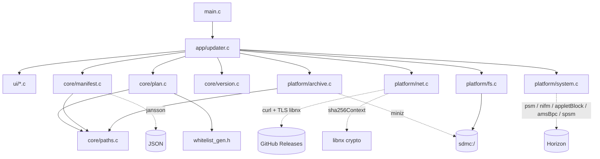
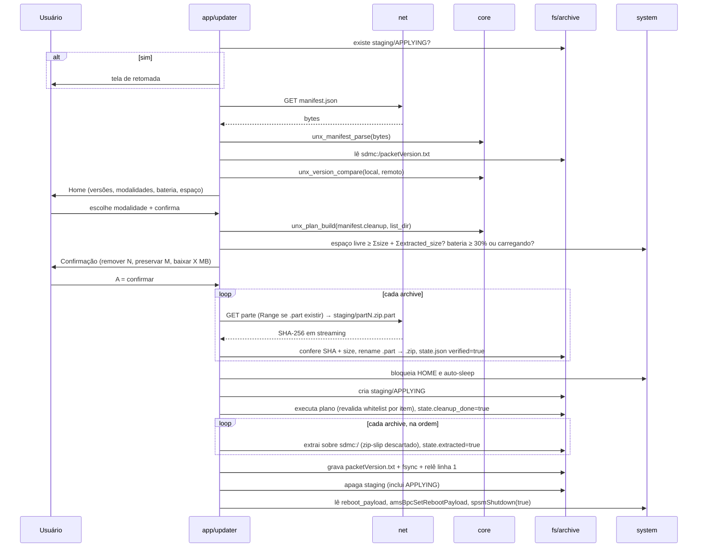
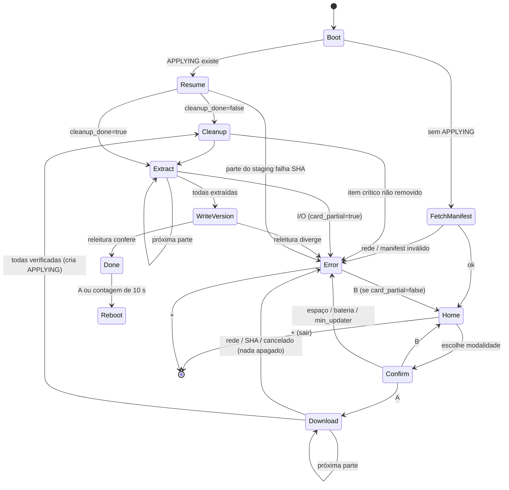

# Arquitetura do UltraNX-NX

Homebrew `.nro` em C11 + libnx que atualiza o pacote R O X no próprio console.
Contratos de dados em [`data-model.md`](data-model.md); contrato HTTP em
[`api.md`](api.md).

## Camadas

```
src/ui/        telas de console (printf + cores ANSI, leitura de botões via padGetButtonsDown)
  ^ chamadas diretas, recebe ViewModel imutável
src/app/       updater.c: pipeline e máquina de estados; única camada que conhece todas as outras
  ^
src/platform/  libnx / curl / miniz / jansson-I/O: net, archive, system, fs
src/core/      C puro (sem <switch.h>): manifest, plan, paths, version, whitelist
include/ultranx/  headers de contrato (congelados em F1)
```

Regras estruturais:

- `src/core/` **não** inclui `<switch.h>`, `<curl/curl.h>` nem miniz. Recebe
  bytes/strings, devolve structs. Compila com gcc no host para testes.
- `src/core/` não faz I/O de disco nem de rede, com uma exceção: o plano de
  limpeza recebe uma função de listagem de diretório injetada
  (`UnxListDirFn`), para ser testável com árvore falsa.
- `src/platform/` não decide nada de domínio: só executa e converte erro de
  sistema em `UnxError`.
- `src/ui/` não chama `platform/` nem `core/`: recebe dados prontos de `app/`.
- Sem romfs: o `.nro` não fica aberto durante a execução, o que permite que o
  pacote o sobrescreva.

## Componentes



`whitelist_gen.h` é gerado no build a partir de `docs/whitelist.json`, que por
sua vez é gerado de `src/ultranx/config.py` (ADR-5).

## Pipeline



Princípio central: **nada é apagado antes de todas as partes estarem no cartão
e verificadas** (ADR-2). Uma falha de rede não deixa o console sem sistema.

## Máquina de estados



Cancelamento (botão B durante o download) é cooperativo: `net` consulta
`should_cancel()` entre chunks. A partir de `Cleanup`, o cancelamento é
**desabilitado** — interromper no meio deixa o cartão sem sistema completo, e a
retomada é o único caminho seguro.

Retomada: `state.json` guarda `cleanup_done` e `extracted` por parte. Antes de
re-extrair, cada parte com `extracted=false` tem o SHA-256 conferido de novo
(o cartão pode ter sido mexido no PC entre as sessões).

## Contratos (`include/ultranx/`)

Structs são preenchidas por uma função construtora e tratadas como somente
leitura depois disso (ponteiros `const` nas APIs consumidoras). Toda memória é
liberada pela função `*_free` do próprio módulo. Strings são UTF-8 terminadas
em `\0`. Sem estado global fora de `app/`.

### `errors.h`

```c
typedef enum {
    UNX_OK = 0,
    UNX_E_NET_OFFLINE,        /* sem conexão (nifm) */
    UNX_E_NET_HTTP,           /* status inesperado */
    UNX_E_NET_TIMEOUT,
    UNX_E_NET_TLS,
    UNX_E_MANIFEST_INVALID,
    UNX_E_UPDATER_TOO_OLD,    /* min_updater > versão do app */
    UNX_E_HASH_MISMATCH,
    UNX_E_SIZE_MISMATCH,
    UNX_E_NO_SPACE,
    UNX_E_LOW_BATTERY,
    UNX_E_IO,                 /* falha de leitura/escrita no SD */
    UNX_E_REMOVE_CRITICAL,    /* item crítico não removido */
    UNX_E_ARCHIVE_CORRUPT,
    UNX_E_ARCHIVE_TOO_LARGE,  /* zip bomb: entradas ou bytes acima do limite */
    UNX_E_VERSION_WRITE,      /* packetVersion não confirmou na releitura */
    UNX_E_PAYLOAD_MISSING,
    UNX_E_CANCELLED,
    UNX_E_OOM,
} UnxCode;

typedef enum {
    UNX_STAGE_MANIFEST, UNX_STAGE_PREFLIGHT, UNX_STAGE_DOWNLOAD,
    UNX_STAGE_CLEANUP, UNX_STAGE_EXTRACT, UNX_STAGE_VERSION, UNX_STAGE_REBOOT,
} UnxStage;

typedef struct {
    UnxCode  code;
    UnxStage stage;
    char     message[256];   /* o que aconteceu, com o caminho/URL envolvido */
    const char *guidance;    /* texto estático por código: o que o usuário faz agora */
    bool     card_partial;   /* true a partir de Cleanup: sistema incompleto no cartão */
} UnxError;

const char *unx_guidance(UnxCode code);
void unx_error_set(UnxError *err, UnxCode code, UnxStage stage, const char *fmt, ...);
```

### Tipos comuns de progresso

```c
/* done/total na unidade da etapa (bytes, itens, entradas); label = arquivo atual. */
typedef void (*UnxProgressFn)(uint64_t done, uint64_t total, const char *label, void *ctx);
typedef bool (*UnxCancelFn)(void *ctx);   /* true = parar no próximo ponto seguro */
```

### `paths.h`

```c
#define UNX_PATH_MAX 256
#define UNX_PATH_MAX_DEPTH 4

/* Rejeita absoluto, "..", "\\", ":", componente vazio, controle, >4 níveis, >255 chars. */
bool unx_path_is_valid_relative(const char *rel);
/* Junta raiz + relativo e garante contenção; false se escaparia (zip-slip). */
bool unx_path_join_within(const char *root, const char *rel, char *out, size_t out_len);
/* Comparação casefold ASCII (FAT32). */
bool unx_path_equal(const char *a, const char *b);
/* "a/b" é igual a "a/b/..." ou ancestral? */
bool unx_path_has_prefix(const char *path, const char *prefix);
```

### `manifest.h`

```c
typedef enum { UNX_MOD_STANDARD = 0, UNX_MOD_FULL = 1, UNX_MOD_COUNT } UnxModality;

typedef struct {
    char     url[1025];
    char     sha256[65];      /* minúsculo; vazio só em v1 */
    uint64_t size;
    uint64_t extracted_size;  /* size*2 quando ausente */
} UnxArchive;

typedef struct {
    bool       present;
    char       label[65];
    UnxArchive *archives;
    size_t     archive_count; /* 1..16 */
} UnxPackage;

typedef struct {
    char   **delete_paths;    size_t delete_count;
    char   **delete_children; size_t delete_children_count;
    char   **preserve;        size_t preserve_count;
    bool     from_defaults;   /* cleanup ausente no manifest */
} UnxCleanup;

typedef struct {
    int        schema;        /* 1 ou 2 */
    char       version[32];
    char       released[11];  /* "YYYY-MM-DD" ou "" */
    char       min_updater[32];
    UnxPackage packages[UNX_MOD_COUNT];
    UnxCleanup cleanup;
    char       reboot_payload[UNX_PATH_MAX];
    char       warnings[8][128]; size_t warning_count; /* itens descartados por whitelist etc. */
} UnxManifest;

/* base_url resolve archives[].url relativas. allow_http vem do config.json. */
bool unx_manifest_parse(const char *json, size_t len, const char *base_url,
                        bool allow_http, UnxManifest **out, UnxError *err);
void unx_manifest_free(UnxManifest *m);
```

### `version.h`

```c
typedef struct {
    bool present;
    char version[32];
    char released[11];
} UnxInstalled;

bool unx_version_parse_file(const char *text, size_t len, UnxInstalled *out);
/* <0, 0, >0 por componente numérico; "1.5" == "1.5.0". */
int  unx_version_compare(const char *a, const char *b);
/* Conteúdo exato a gravar: "<version>\n<released>\n". */
size_t unx_version_format(const UnxManifest *m, char *out, size_t out_len);
```

### `plan.h`

```c
typedef struct { char name[UNX_PATH_MAX]; bool is_dir; } UnxDirEntry;
/* Injetada: lista filhos diretos de rel ("" = raiz). Retorna contagem ou -1. */
typedef int (*UnxListDirFn)(const char *rel, UnxDirEntry *out, size_t cap, void *ctx);

typedef enum { UNX_ITEM_REMOVE_TREE, UNX_ITEM_REMOVE_FILE } UnxItemKind;

typedef struct {
    char        rel[UNX_PATH_MAX];
    UnxItemKind kind;
    bool        critical;      /* ex.: atmosphere/package3 — falha aborta */
    const char *reason;
} UnxPlanItem;

typedef struct {
    UnxPlanItem *items;    size_t item_count;
    char       **preserved; size_t preserved_count;
} UnxPlan;

/* Whitelist embutida ∪ cleanup.preserve; whitelist vence sempre. */
bool unx_is_protected(const UnxCleanup *c, const char *rel);
bool unx_plan_build(const UnxCleanup *c, UnxListDirFn list, void *ctx,
                    UnxPlan **out, UnxError *err);
void unx_plan_free(UnxPlan *p);
```

### `net.h`

```c
typedef struct {
    const char *url;
    const char *dest_path;     /* ...partN.zip.part; retoma se existir */
    uint64_t    expected_size;
    const char *expected_sha256; /* NULL = não verificar (só v1) */
    UnxProgressFn progress; UnxCancelFn should_cancel; void *ctx;
} UnxDownloadReq;

bool unx_net_init(UnxError *err);   /* socket, nifm, curl_global_init */
void unx_net_exit(void);
bool unx_net_is_online(void);
/* Corpo pequeno em memória (manifest, packetVersion): limite 1 MiB. */
bool unx_net_get_small(const char *url, char **body, size_t *len, UnxError *err);
/* Streaming para disco + SHA-256; recalcula hash do trecho já baixado ao retomar. */
bool unx_net_download(const UnxDownloadReq *req, UnxError *err);
```

### `archive.h`

```c
/* Extrai sobre root. Entradas fora de root são descartadas e contadas em *skipped. */
bool unx_archive_extract(const char *zip_path, const char *root,
                         UnxProgressFn progress, void *ctx,
                         size_t *skipped, UnxError *err);
```

Sem cancelamento: a extração só roda depois de `Cleanup`.

### `system.h`

```c
typedef struct {
    uint32_t battery_pct;
    bool     charging;
    uint64_t sd_free_bytes;
    bool     applet_mode;   /* aviso: memória reduzida */
} UnxSystemStatus;

bool unx_system_status(UnxSystemStatus *out, UnxError *err);
void unx_system_lock_session(void);    /* bloqueia HOME + auto-sleep */
void unx_system_unlock_session(void);
/* Lê o payload para memória, define via amsBpc e reinicia. Só retorna em falha. */
bool unx_system_reboot_to_payload(const char *sd_path, UnxError *err);
```

### `ui.h`

```c
typedef enum { UNX_INPUT_NONE, UNX_INPUT_A, UNX_INPUT_B, UNX_INPUT_X,
               UNX_INPUT_UP, UNX_INPUT_DOWN, UNX_INPUT_PLUS } UnxInput;

typedef struct {               /* montado por app/, só lido pela ui */
    UnxInstalled installed;
    const UnxManifest *manifest;
    UnxModality selected;
    UnxSystemStatus status;
    const UnxPlan *plan;
    uint64_t total_download, total_required;
} UnxHomeView;

void     unx_ui_init(void);
UnxInput unx_ui_poll(void);
void     unx_ui_home(const UnxHomeView *v);
void     unx_ui_confirm(const UnxHomeView *v);
void     unx_ui_progress(UnxStage stage, uint64_t done, uint64_t total,
                         const char *label, uint32_t eta_seconds);
void     unx_ui_error(const UnxError *e);
void     unx_ui_done(const char *version, uint32_t reboot_in_seconds);
void     unx_ui_resume(const char *version, size_t parts_left);
```

## Falhas

| Falha | Etapa | Estado do cartão | Orientação ao usuário |
| --- | --- | --- | --- |
| Sem internet / timeout | Manifest, Download | intacto | Verifique o Wi-Fi e tente de novo; o download retoma de onde parou |
| Manifest inválido | Manifest | intacto | Servidor publicou manifest com erro; avise quem mantém o pacote |
| App desatualizado (`min_updater`) | Preflight | intacto | Atualize o UltraNX-NX (link na tela) antes de continuar |
| Espaço insuficiente | Preflight | intacto | Libere X GB no cartão (mostra quanto falta) |
| Bateria < 30% sem carregador | Preflight | intacto | Conecte o carregador |
| SHA-256/tamanho divergente | Download | intacto; parte descartada | Download corrompido; tente de novo. Persistindo, o pacote publicado está errado |
| Cancelado (B) | Download | intacto; `.part` mantido | Pode retomar depois |
| Item crítico não removido | Cleanup | parcial (`APPLYING`) | Reabra o app para retomar; se repetir, use o UltraNX no PC |
| Remoção não crítica falhou | Cleanup | segue (aviso no log) | — (a extração sobrescreve) |
| Erro de I/O / cartão removido | Cleanup, Extract | parcial (`APPLYING`) | **Não desligue pelo hekate antes de reabrir o app**; reabra-o para retomar. Sem boot: use o UltraNX no PC |
| Zip corrompido no staging | Extract, Resume | parcial | A parte é baixada de novo na retomada |
| `packetVersion.txt` não confirma | Version | arquivos novos, versão não gravada | Reabra o app; a retomada só regrava a versão |
| Payload ausente | Reboot | atualizado | Reinicie manualmente segurando VOL+ para entrar no hekate |

Toda falha grava o log em `ultranx-nx/logs/` antes de mostrar a tela de erro.

## Decisões (ADR curto)

**ADR-1 — App próprio em C + libnx, não fork do AIO Switch Updater.**
O AIO (GPL-3.0, C++/Borealis) cobre download e reboot, mas não lista de remoção
vinda do servidor nem `packetVersion.txt`, e traz firmware, cheats e UI que
não usamos. Um app de propósito único fica em 1–2 mil linhas auditáveis.
Custo: escrever download/extração/reboot (mitigado pelo spike F0).

**ADR-2 — Baixar e verificar tudo antes de apagar qualquer coisa.**
Exige espaço para todas as partes ao mesmo tempo (Σsize + Σextracted_size), mas
falha de rede nunca deixa o console sem sistema. Alternativa (baixar parte →
extrair → próxima) economiza espaço e foi rejeitada pelo risco.

**ADR-3 — `.zip` no console, `.7z` só no PC.**
7z sólido exige descomprimir blocos inteiros, é lento no ARM do console e
dificulta progresso por entrada. Deflate permite extração entrada a entrada com
miniz. `make_release.py` gera zips; o app de PC continua aceitando ambos.

**ADR-4 — Interface de console de texto, não Borealis/SDL.**
São 7 telas lineares com botões A/B/X/+. Texto elimina dependência gráfica,
reduz memória (importa em applet mode) e o tamanho do `.nro`.

**ADR-5 — Whitelist gerada de `config.py`.**
Uma fonte única evita PC e console divergirem no que nunca pode ser apagado.
`config.py` → `docs/whitelist.json` → `include/ultranx/whitelist_gen.h` no
build; o CI falha se o header gerado estiver desatualizado.

## Resultados do spike F0

<!-- Preencher após F0: versões das portlibs (switch-curl, switch-jansson,
switch-zlib), backend TLS confirmado, tempo de download de 50 MB, tempo de
extração de 1.000 arquivos, confirmação do reboot para payload, memória livre
em applet mode vs. title override. -->
