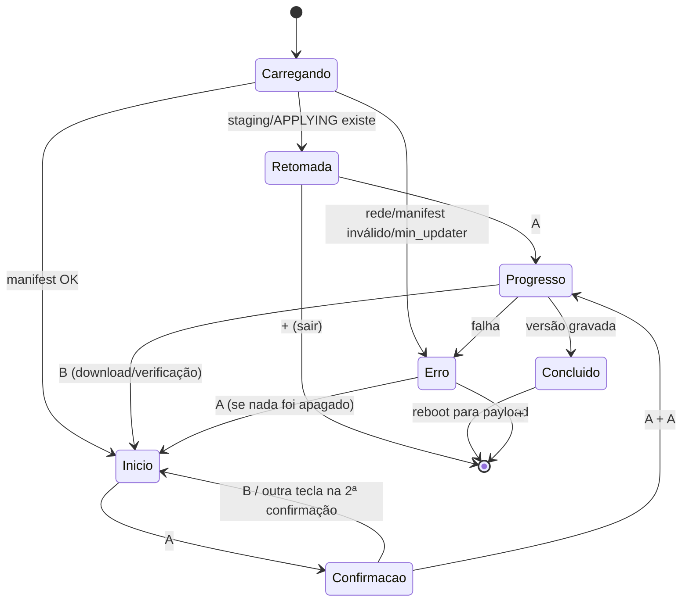

# Interface (console de texto)

`consoleInit(NULL)` da libnx, grade de 80×45 caracteres, um quadro redesenhado
por evento (sem animação além da barra de progresso). Sem romfs, sem fontes
próprias. Requisitos citados em `requirements.md`.

## Convenções visuais

| Cor ANSI | Significado | Sempre acompanhada de |
| --- | --- | --- |
| Ciano | título, rótulos | — |
| Verde | sucesso, "atualizado" | prefixo `[OK]` |
| Amarelo | aviso, ação destrutiva pendente | prefixo `[!]` |
| Vermelho | erro, "não desligue" | prefixo `[ERRO]` / `[!!]` |
| Branco | texto comum, valores | — |

- A cor nunca é a única pista: todo estado tem prefixo textual.
- Linha ≤ 78 colunas; mensagens curtas, verbo no imperativo.
- Rodapé fixo (linha 44) com os botões válidos naquela tela.
- Ação destrutiva = confirmação dupla (RF-08).
- Tamanhos em MB/GB com 1 casa; tempo em `mm:ss` ou `h mm`.

## Botões

| Botão | Ação |
| --- | --- |
| D-pad ↑/↓ | mover seleção (modalidade) |
| A | confirmar / avançar / reiniciar agora |
| B | voltar / cancelar (só antes da limpeza) |
| + | sair do app (desabilitado entre a limpeza e o reboot) |

## Fluxo



## Telas

### Carregando (estado de loading)

```
 UltraNX-NX v1.0.0
 ------------------------------------------------------------------------------
 Lendo cartão...                 [OK]
 Baixando manifest...            |
```

Spinner textual `| / - \`. Timeout de rede ⇒ Erro.

### Início

```
 UltraNX-NX v1.0.0
 ------------------------------------------------------------------------------
 Instalada : 1.4.2  (2026-08-15)
 Publicada : 1.5.0  (2026-10-01)        [!] Atualização disponível

 Escolha o pacote:
  > Pacote Padrão                          700,0 MB
    Pacote Completo (Android/Linux)          5,0 GB  (3 partes)

 Bateria 78% (carregando)   Livre no cartão 41,2 GB
 ------------------------------------------------------------------------------
 ↑↓ escolher   A continuar   + sair
```

Estados:
- **Vazio**: sem `packetVersion.txt` ⇒ "Instalada : nenhuma".
- **Atualizado**: versões iguais ⇒ `[OK] Já está na versão publicada`; A continua
  disponível como "Reinstalar".
- **Uma modalidade só**: lista com um item, já selecionado.

### Confirmação

```
 Confirmar: Pacote Padrão 1.5.0
 ------------------------------------------------------------------------------
 Baixar      : 700,0 MB  (1 parte)
 Espaço      : precisa 1,5 GB  |  livre 41,2 GB          [OK]
 Bateria     : 78% (carregando)                          [OK]

 Será apagado (12):
   atmosphere/   bootloader/   config/   payload.bin
   switch/Tinfoil   switch/DBI   ... e mais 6
 Preservado:
   Nintendo/   emummc/   switch/JKSV   *.keys   *.sav

 [!] Nada é apagado antes do download terminar e ser verificado.
 ------------------------------------------------------------------------------
 A confirmar   B voltar
```

Segunda etapa (após o primeiro A), linha 40 em amarelo:
`[!] Isto apaga 12 itens. Pressione A de novo para confirmar.`

Bloqueios (A desabilitado, motivo em vermelho com `[ERRO]`):
espaço insuficiente (mostra quanto falta) ou bateria < 30% sem carregador.

### Progresso

```
 Atualizando para 1.5.0
 ------------------------------------------------------------------------------
 [OK] Download          700,0 / 700,0 MB
 [OK] Verificação       SHA-256 confere
 >>   Limpeza           8 / 12   switch/DBI
      Extração
      Finalização

 [##############################..........................]  52%
 4,1 MB/s   restante ~ 03:10

 [!!] NÃO DESLIGUE O CONSOLE
 ------------------------------------------------------------------------------
 (sem botões durante a aplicação)
```

- Download/verificação: rodapé `B cancelar`, sem o aviso "NÃO DESLIGUE".
- Partes múltiplas: `Download  parte 2/3  1,2 / 1,9 GB`.
- MB/s e ETA com média móvel (mesmo critério do `RateEstimator` do PC: nada
  antes de 2%).

### Concluído

```
 [OK] Atualizado para 1.5.0
 ------------------------------------------------------------------------------
 Reiniciando no hekate em 10 s...

 ------------------------------------------------------------------------------
 A reiniciar agora
```

Sem o payload: `[!] Payload não encontrado. Reinicie pelo menu e entre no hekate.`
e rodapé `+ sair`.

### Erro

```
 [ERRO] Falha no download da parte 2/3
 ------------------------------------------------------------------------------
 Conexão interrompida (timeout após 30 s).

 O que fazer: verifique a Wi-Fi e tente de novo. O download continua de
 onde parou.

 Estado do cartão: [OK] nada foi apagado.
 Log: ultranx-nx/logs/ultranx-nx.log
 ------------------------------------------------------------------------------
 A tentar de novo   + sair
```

Com o cartão parcial (falha após o início da limpeza):
`Estado do cartão: [!!] atualização incompleta. Abra o app de novo para retomar.`
— rodapé só `+ sair` (a retomada acontece pela tela Retomada).

### Retomada

```
 [!] Atualização interrompida: 1.5.0 (Pacote Completo)
 ------------------------------------------------------------------------------
 Limpeza   : [OK] concluída
 Extração  : parte 1/3 [OK]   parte 2/3 pendente   parte 3/3 pendente

 O sistema pode não iniciar até a atualização terminar.
 ------------------------------------------------------------------------------
 A continuar   + sair
```

## Acessibilidade (limites do console)

- A cor nunca é o único canal (prefixos `[OK]/[!]/[ERRO]`).
- Textos curtos, uma ação por tela, rodapé sempre dizendo o que cada botão faz.
- A ação destrutiva exige confirmação dupla e não aceita repetição automática
  da tecla (só a borda de `kDown`).
- Sem limite de tempo para decidir, exceto a contagem de reboot (A antecipa e
  não há ação a perder).
- Sem leitor de tela no homebrew: está fora do alcance da plataforma.
